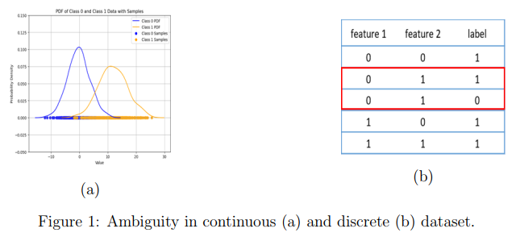
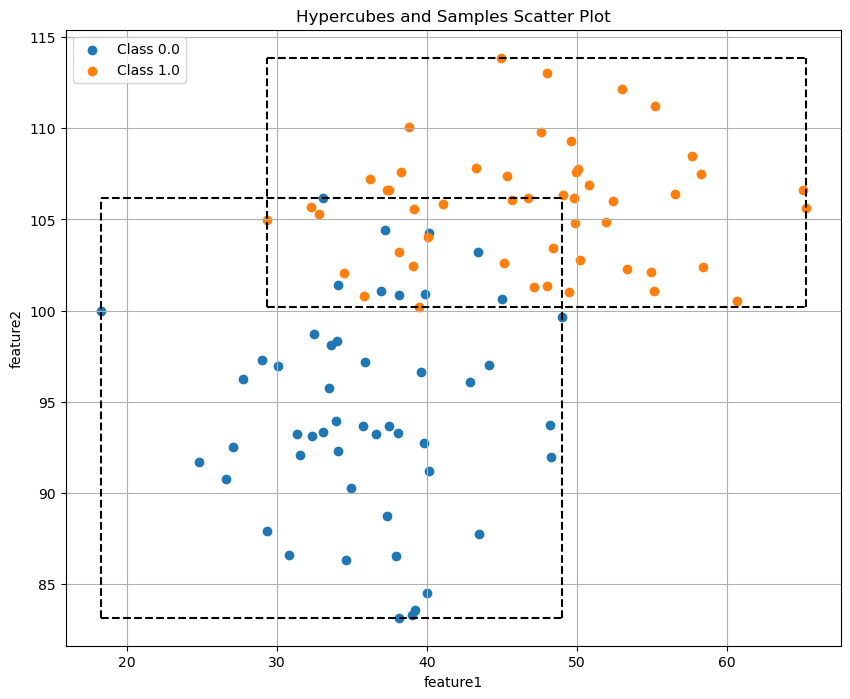
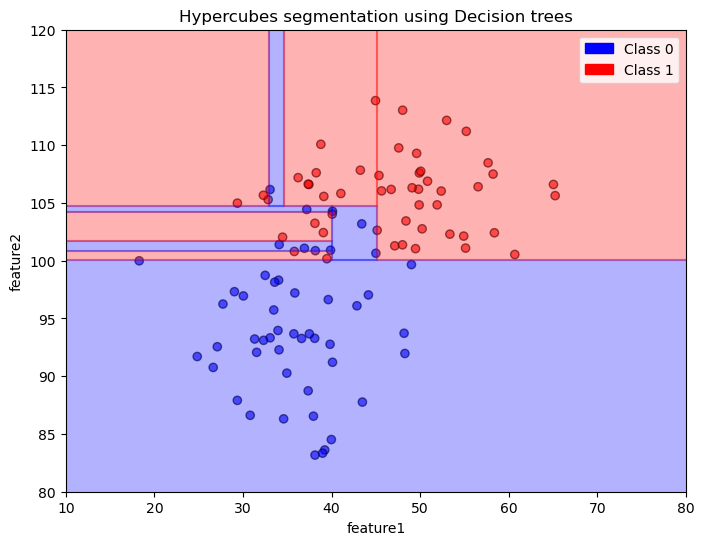
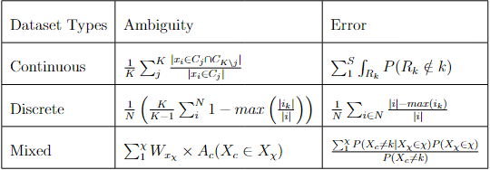
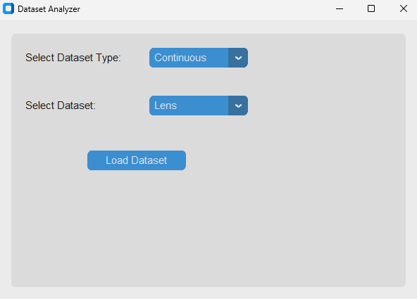

# DLL_Seminar_SS_2024
## Ambiguity in Datasets
Ambiguity in data presents a substantial challenge in the classification process, significantly limiting the effectiveness of classification models. Ambiguity often arises in weakly structured datasets where a significant portion of data samples dispersed around the whole feature space. The following shows a case for ambiguity for continuous and discrete cases. 

<div style="text-align: center;">
  
</div>

In this project we defined the the ambiguity and derived mathematical expressions for ambiguity and error for continuous and discrete datasets. Additionally, we discuss the merits and the potential limitations of our methods by implementing it on different real world datasets.

To minimize complications, we adopted a case-by-case approach by considering ambiguity and potential errors specific to each situation. As a result, we divided the concept into two distinct types of datasets: those with continuous features and those with discrete features. 

## Continuous Features Dataset
In datasets with continuous features, values can range across the entire set of real numbers. Ambiguity in this context arises from the overlap between feature spaces of different classes. Accurate estimation of this ambiguity requires knowledge of the distribution of features within each class. However, since domain knowledge about the distribution of real-world datasets is often unavailable, we must generalize our approach.

To generalize, we use a rectangular hypercube to represent the feature space. Ambiguity arises from data samples located within the overlapping regions of these hypercubes, which represent different classes. This ambiguity can be quantified using the following equation:
$$  A_c = \frac{1}{K} \sum_{j}^{K} \frac{{|x_i \in C_j \cap C_{K \setminus j}}|}{|x_i \in C_j|} $$

Here, $|x_i \in C_j \cap C_{K \setminus C_j}|$  denotes the number of samples that belong to class $j$ and also reside in the overlapping regions with other classes., while $|x_i \in  C_j|$ represents the number of samples belonging to class j. k denotes the total number of classes.
<div style="text-align: center;">
  
</div>
The figure shows an example of hypercubes on synthetically generated dataset.
<br>
The maximum error resulting from this ambiguity can be estimated by greedily segmenting the dataset such that each segment ${R_k}$ , contains only the samples of class k. Within these segments, we then estimate the probability that the samples belong to classes other than their original class k. This concept can be mathematically formulated as follows:

$$E_c = \sum_{1}^{S} \int_{R_k} P(R_k \notin k)$$

Here, $E_c$ denotes the error for the continuous case, while $S$ represents the total number of segments. ${R_k}$ refers to an individual segmented hypercube, and 
$P(R_k\notin k)$  indicates the probability that the samples within this segment belong to classes other than the original class k.

<div style="text-align: center;">
  
</div>
The figure above shows the segmentation process achieve on syntehtic datasets using decision tree classifier.

<br>

## Discrere Featured Dataset
For discrete or categorical-featured datasets, ambiguity arises when the same feature combination is assigned different labels. To compute this ambiguity, we first calculate the probability of each feature combination belonging to a certain class. Based on these probability values, the true label can be assigned by majority voting or by selecting the class with the highest probability. The probability of a feature combination belonging to any other class is then considered as ambiguity. By normalizing this value according to the number of classes and taking the mean across all feature combinations, we obtain the ambiguity value for the entire dataset. This concept can be formulated as follows:

$$ A_d =  \frac{1}{N}\left(\frac{K}{K-1} \sum_{i}^{N} 1- max\left(\frac{|i_k|}{|i|}\right)\right) $$

Here, ${k}$ is the number of classes, ${N}$ is the number of permutations of feature combinations in the dataset $D$, ${|i_k|}$  is the number of instances where the ${i}$-th feature combination belongs to class k, and ${|i|}$ is is the total number of times the $i$-th feature combination appears in the dataset.

Now the error arises from this ambiguity can be calculated using the following approach. For every feature combination first count the total number of instances of that feature combination in the entire dataset ${D}$. And then using majority voting find the most probable class for that feature combination. subtracting this number of instances for the most probable class from total instance count of that particular feature combination will give us the error count for that feature combination. and then by normalizing it for all feature combination we can get the error for categorical cases. this concept can be expressed by following equation:

$$ E_d = \frac{1}{N} \sum_{i\in N } \frac{|i| -max(i_k)}{|i|} $$

Here, ${E_d}$ represents the error for the discrete dataset, ${N}$ is the total number of feature combinations, ${|i|}$ denotes the total number of occurrences of a feature combination ${i}$, and ${i_k}$ is the number of occurrences of feature combination ${i}$ for class ${k}$. 

<br>

## Mixed Dataset
For datasets containing both continuous and categorical features, calculating ambiguity and error can be more complex due to the mixed nature of the features. One approach to handle this challenge involves segmenting the dataset based on combinations of categorical features, denoted as $X_{\chi}$. This segmentation results in a set of segments $\chi$, where each segment corresponds to a unique combination of categorical features. Within each segment, the ambiguity is calculated solely based on the continuous features using the method previously described for the continuous case. A weighted sum of these segment-specific ambiguities, determined by the sample count in each segment, can then be used to estimate the overall ambiguity for the mixed-feature dataset. This approach can be formulated as follows:

$$ A_m = \sum_{1}^{\chi} W_{x_\chi} \times A_c(X_c \in X_{\chi} ) $$
Where, 

* ${\chi}$ represents the set of segments created by splitting the dataset based on combinations of categorical features.
*  $ W_{x_\chi}$ denotes the weight associated with a particular segment $X_{\chi}$, calculated based on the number of samples in $X_{\chi}$ and the total number of samples in dataset.
* $A_c(X_c \in X_{\chi} )$ represents the ambiguity calculated using only the continuous features $X_c$ within the categorical segment $X_{\chi}$


To estimate the error for the entire mixed-feature dataset, we can calculate the error for the continuous features in each segment, $X_{\chi}$, multiply it by the probability of that segment, and then normalize it by the overall error probability computed from the entire dataset. This can be expressed mathematically as:
 $$ E_m =\frac{ \sum_{1}^{\chi} P(X_c \neq k|X_{\chi} \in \chi ) P(X_{\chi} \in \chi)}{P(X_c \neq k) } $$
Where,

*  $\chi$ is the set of segmented datasets based on categorical feature combinations $X_{\chi}$ that contain continuous feature samples , $X_c$.
* $P(X_c \neq k|X_{\chi} \in \chi )$ represents the probability that a sample with continuous features belongs to a class other than the true class $k$,  given that the sample belongs to the categorical segment $X_{\chi}$.
* $P(X_{\chi} \in \chi)$ denotes the probability of a particular categorical feature combination $X_{\chi}$
* $P(X_c \neq k)$ is the overall error probability calculated for the continuous feature samples $X_c$ across the entire dataset.

<br>
<br>

## Overview of Ambiguity and Error Calculation Methods

The table below presents the formulas for calculating ambiguity and error for three types of datasets: continuous, discrete, and mixed. 

<div style="text-align: center;">
  
</div>


## Installation
Step 1: clone the repository.
```bash
git clone https://gitlab.cs.fau.de/cdh-seminars/dataset-learning-limit/dll_seminar_ss_2024.git
```
Step 2:  To run this project, you need to have Python installed along with the necessary dependencies. You can install the required packages using `pip`:

```bash
pip install -r requirements.txt
```
step 3: Execute the main Python script in script to start the application:
```bash
python main.py
```
step 4: Interact with the GUI:
* Choose a dataset type from the dropdown menu.
* Select a dataset for analysis 
* View the results directly in the app ny pressing the Load Dataset button.

<br>
Brief Process to add new datasets: 
<br>
Most of the datasets were collected from UCI machine learning reporsitory. 
New datasets can be added using the dataloader.py file in the src package. The process is explained briefly below:

* Determine Dataset Type: Identify if the dataset is continuous, discrete, or mixed.
* Create a Loader Function: Add a new function in dataloader.py that loads and preprocesses the dataset. Use LabelEncoder for categorical data if needed.
* Update dataset_loaders Dictionary: In the __init__ method of DataLoader, add the new loader function to the relevant dictionary (continuous, discrete, or mixed).


## App visual
Below is the screenshot of the application interface:
<div style="text-align: center;">
  
</div>
