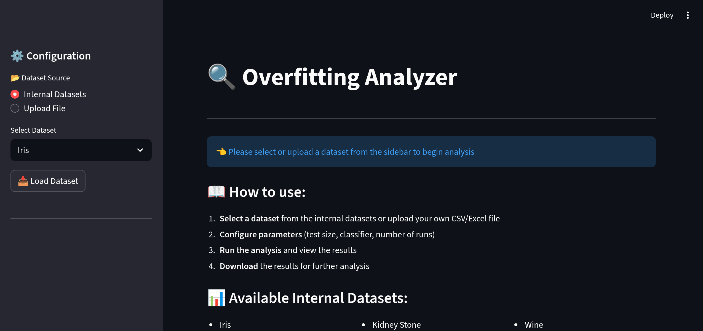
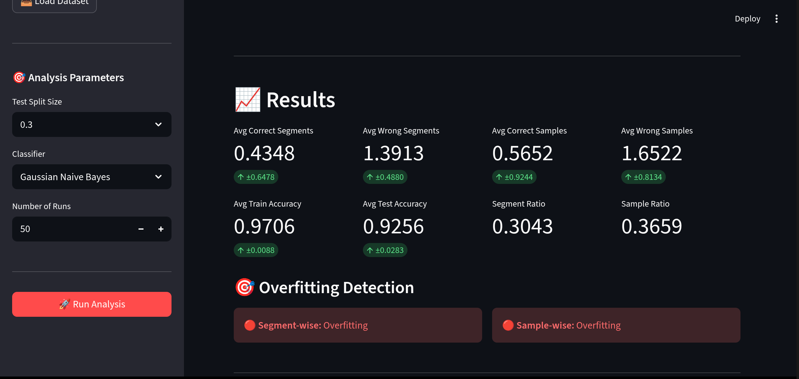

# DLL_Seminar_SS_2024

## Seminar Overview
This seminar project explores dataset ambiguity and its impact on machine learning model performance. We developed mathematical frameworks for quantifying ambiguity in continuous, discrete, and mixed-feature datasets, and created an interactive overfitting detection tool using mini-cluster analysis.

<div style="text-align: center;">
  
</div>

---

## Mathematical Framework

### Continuous Features Dataset
Ambiguity arises from overlap between feature spaces of different classes. We use rectangular hypercubes to represent feature space:

$$A_c = \frac{1}{K} \sum_{j}^{K} \frac{{|x_i \in C_j \cap C_{K \setminus j}}|}{|x_i \in C_j|}$$ 

<div style="text-align: center;">
  
</div>

Error estimation through greedy segmentation:

$$E_c = \sum_{1}^{S} \int_{R_k} P(R_k \notin k)$$

<div style="text-align: center;">
  
</div>

### Discrete Featured Dataset
For categorical datasets, ambiguity occurs when identical feature combinations have different labels:

$$A_d = \frac{1}{N}\left(\frac{K}{K-1} \sum_{i}^{N} 1- max\left(\frac{|i_k|}{|i|}\right)\right)$$

Error calculation using majority voting:

$$E_d = \frac{1}{N} \sum_{i\in N } \frac{|i| -max(i_k)}{|i|}$$

### Mixed Dataset
For mixed-feature datasets, we segment by categorical features and calculate continuous ambiguity within each segment:

$$A_m = \sum_{1}^{\chi} W_{x_\chi} \times A_c(X_c \in X_{\chi})$$

$$E_m =\frac{ \sum_{1}^{\chi} P(X_c \neq k|X_{\chi} \in \chi ) P(X_{\chi} \in \chi)}{P(X_c \neq k)}$$

<div style="text-align: center;">
  
</div>

---

## Project: Overfitting Detection using Mini-Cluster Analysis

### Overview
This project implements a method to detect overfitting by evaluating a model's ability to generalize to unseen, label-homogeneous mini-clusters in the feature space. Instead of relying solely on global accuracy, the dataset is partitioned into small, class-pure segments and the model is tested on segments excluded from training to reveal localized generalization failures.

### Key Metrics
Two complementary metrics are computed on unseen segments:

$$\eta_{seg} = \frac{\text{Number of correctly classified unseen segments}}{\text{Number of incorrectly classified unseen segments}}$$

$$\eta_{sam} = \frac{\text{Number of correctly classified samples in unseen segments}}{\text{Number of incorrectly classified samples in unseen segments}}$$

### Interpretation
- If η < 1, the model is considered to exhibit **overfitting** (poor local generalization)
- If η > 1, the model generalizes well to unseen local regions

### Streamlit Application
The project includes an interactive web application built with Streamlit that provides:

- **Dataset Selection**: Choose from 10+ pre-loaded UCI datasets or upload custom CSV/Excel files
- **Classifier Options**: Gaussian Naive Bayes, Logistic Regression, SVM, Random Forest
- **Configurable Parameters**: Test split size, number of analysis runs
- **Real-time Analysis**: Live computation of overfitting metrics
- **Visualization**: Density plots of segment and sample ratios
- **Export Functionality**: Download results as CSV for further analysis

### Usage
1. Train a decision tree to full purity on the dataset to generate label-homogeneous segments
2. Create train/test splits and identify segments containing only test samples (unseen segments)
3. Evaluate model predictions on samples in unseen segments and compute η_seg and η_sam

### Notes
This method is complementary to standard evaluation metrics (accuracy, cross-validation) and is particularly useful for diagnosing localized memorization versus genuine pattern learning.

## Installation and Usage

1. Clone the repository:
```bash
git clone https://github.com/Mohammad-Shiblu/Dataset-Learning-Limit
cd dll
```

2. Install dependencies:
```bash
pip install -r requirements.txt
```

3. Run the overfitting analyzer:
```bash
streamlit run overfitting_analyser.py
```

4. Access the web interface at `http://localhost:8501`

## Project Structure

```
├── src/
│   ├── continuous.py      # Continuous dataset analysis
│   ├── discrete.py        # Discrete dataset analysis
│   ├── data_loader.py     # Dataset loading utilities
│   ├── model.py          # Machine learning models
│   └── visualization.py   # Plotting functions
├── notebooks/            # Jupyter notebooks for analysis
├── data/                # Dataset files
├── output/              # Generated plots and results
└── overfitting_analyser.py  # Main Streamlit application
```

## Available Datasets

The tool includes 10 pre-loaded datasets from the UCI ML repository:
- Iris, Wine, Heart Attack, Kidney Stone
- Anaemia, Breast Cancer, Rice, Gender Classification
- Dry Bean, Blood Transfusion

Custom datasets can be uploaded via the web interface (CSV/Excel format with 'class' column required).

## Application Demo

Below are screenshots of the overfitting analyzer application interface:

<div style="text-align: center;">
  
</div>

<div style="text-align: center;">
  
</div>
